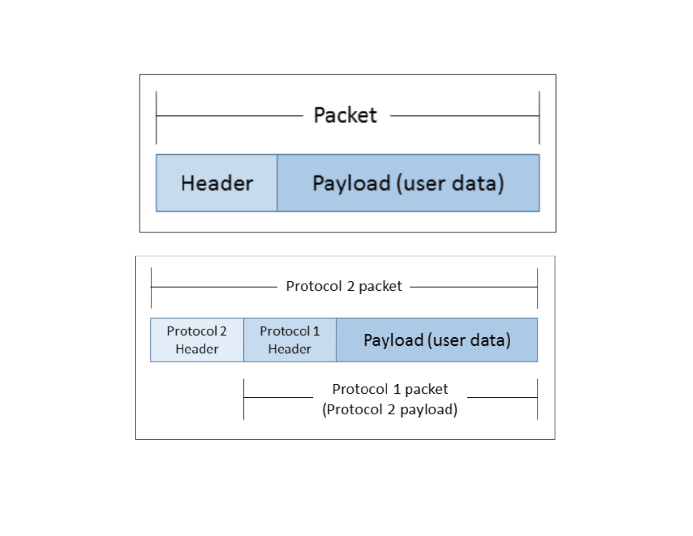

# TCP/IP networks
## IP Addresses
Referring to the [terminal.md](terminal.md) commands, the following bash commands allow us to retrieve our IP address:

```bash
$ ipconfig getifaddr en0
$ ifconfig # look for en0 > inet
```

Two main functions of IP addresses:
- They uniquely address each device that is connected to a network
- They help the traffic to be routed between networks

Notes:
- Each network-connected devices have IP addresses assigned to them
- They can be assigned by network admins in one of two ways
    - Statically: Where the device's OS is manually configured with the IP
    - Dynamically: Where the device's OS is configured using the **Dynamic Host Configuration Protocol (DHCP)**. Under this method, as soon as the device first connects to a network it is allocated an address by a DHCP server from a predefined pool. 

### Private IP Addresses
There exist special IP address ranges that will never be assigned to any organization and at such available for anyone to use for their networks:
- 10.0.0.0 to 10.255.255.255 (16,777,216 IP addresses)
- 172.16.0.0 to 172.31.255.255 (1,048,576 IP addresses)
- 192.168.0.0 to 192.168.255.255 (65,536 IP addresses)

If anyone can use these addresses, wouldn't that lead to devices on the Internet using the same address? No, because traffic from private addresses (the 3 ranges above) do not route over the public Internet. Whenever a network using private addresses need to communicate with the public Internet a protocol known as **Network Address Translation** is used. Our home network and private office network, whether wired or wireless, issue IP addresses that fall into one of the three ranges.
    - NAT is a process in which our router changes our private IP address into a public one so we can transmit data over the Internet
    - When inormations comes back to our router, it reverses the change from a real IP address (public) to a private one and forwards the traffic back to our computer

Private addresses are known as _non-routable addresses_. The networking on the Internet routes Internet activity connected to our public IP address only and not our private IP. Private IP addresses are untracked and unrestricted and IP lookup services cannot geographically locate a user's computer by them.

```bash
$ dig +short myip.opendns.com @resolver1.opendns.com
103.86.158.102
```
103.86.158.102 is our public IP address. When we inspect the output from `ifconfig`, notice that our devices are using private range addresses (not the public one) assigned by our broadband router through DHCP.

## Network Interfaces
Using `ifconfig` we see a list of hardware interfaces on our machine. An interface is a device's physical connection to its network media. A smartphone likely have at least 2 interfaces for example, one for connecting to WiFi networks and one for LTE networks.

An interface is usually assigned only one IP address and each interface in a device has a different IP address. This makes concrete the point about IP addresses' first main function: **uniquely address each device's connection to a network**.

### Loopback interface
Each device has a virtual interface called the loopback interface (aka **localhost**, conventionally assigned 127.0.0.1). From the output of `ifconfig` we see this:
```bash
lo0: flags=8049<UP,LOOPBACK,RUNNING,MULTICAST> mtu 16384
	options=1203<RXCSUM,TXCSUM,TXSTATUS,SW_TIMESTAMP>
	inet 127.0.0.1 netmask 0xff000000 
	inet6 ::1 prefixlen 128 
	inet6 fe80::1%lo0 prefixlen 64 scopeid 0x1 
	nd6 options=201<PERFORMNUD,DAD>
```
- This interface doesn't actually connect to anything outside the device. 
- Only the device itself can communicate with it.
- The 2 points above makes it useful for local network application testing and can be used as a means of inter-process communication.

## Packets
Packetization is used widely across the Internet protocol suite to manage how data is transmitted across a network. This protocol breaks data up into small units (sequences of byters) and prefix the data (**payload**) in each unit (**packet**) with some protocol-specific information (known as **header**). 

Header contains information that the protocol implementation running on another device needs, to know how to interpret the packet. It includes:
- Source IP address
- Destination IP address
- Length of the packet
- Checksum

Protocols may call upon other protocols to handle their packets for them and when both protocols employ packetization it result in nested packets as illustrated below. This is also called **encapsulation**.

| | 
|:--:| 
| *Source: Learning Python Network Programming* |

## Networks
A simplified definition of a network is that all devices on the network share a single point of connection to the rest of the Internet.
- This connection point is called a **gateway**, usually taking the form of a router. 
    - Router direct traffic **between networks** and sits between two or more networks
    - Router has multiple network interfaces, one for each network it is attached to
    - Router contains a set of rules called a routing table so it knows how to direct packets passing through it onwards based on the packets' destination IP addresses
- Gateway forwards the packets to another router (called **upsteam**) and usually located at the network's ISP. The ISP router falls into a second category of routers as it sits outside the networks described earlier and routes traffic between network gateways. These are further arranged in tiers, and upper regional tiers route traffic for larger sections of countries or continents.
    - Each ISP gateway connects an ISP network to the regional routers; ISPs often have more than one gateway connecting them to the regional routers
    - Each home broadband router has a home network connected to it

## Routing with IP
How exactly does routers route traffic toward a destination networking using IP addresses and routing tables? It would be infeasible in practice to program every router's routing table for the everchanging 4 billion+ IP addresses. The answer lies in another property of IP addresses.

- An IP address has two logical parts: **a network prefix** and a **host identifier**. 
    - The network prefix uniquely identifies the network a device is on; It is the first _n_ bits of the IP address when written out in binary. The _n_ bits are supplied by the network admin as part of a network configuration at the same time that it is given its IP address
        - _n_ is written in one of two ways. 
            - It can be appended to the IP address, as such: `192.168.0.186/24`, known as the **CIDR notation**. 
            - It can also be written as a subnet mask (aka netmask) taking the form of a dot-decimal notation just like an IP address: `255.255.255.0`
        - Note that the subnet mask of `255.255.255.0` is equivalent to `/24`.
    - Examples of subnet masks:
        | Dot-decimal notation / Binary notation                   | CIDR |
        | -------------------------------------------------------- |------|
        | 255.0.0.0        =  11111111 00000000 00000000 00000000  | /8   |
        | 255.192.0.0      =  11111111 11000000 00000000 00000000  | /10  |
        | 255.255.255.0    =  11111111 11111111 11111111 00000000  | /24  |
        | 255.255.255.240  =  11111111 11111111 11111111 11110000  | /28  |
        - _n_ is simply the number of 1 bits in the subnet masks from the left, allowing us to quickly get the Network prefix in binary by doing a bitwise `AND` operation on the IP address and the subnet mask
    
- When a network device needs to deliver data across a network, it first compares the destination's IP address with its own network prefix. If the destination IP address has the same network prefix as that of the sending device, then it recognizes that the destination device is on the same network and can send the traffic directly to it. If the network prefixes differ, it will send the message to its default gateway, which will forward it on towards the receiving device.

- When a router receives traffic that has to be forwarded, it does a similar check:
    - Destionation IP address matches the network prefix of any of the networks that it is connected to: send to destination device
        Else: Consult its routing table
            If finds a matching rule: Sends the message to the router that it found listed
                Else: Send traffic to its own default gateway

- When we create a network with a given network prefix, the digits to the right of the network prefix are available for assignment to the network devices. The number of the available addresses is $2^n-2$ since two of the addresses are reserved
    - The first reserved address is called the network address
    - The last reserved address is called the broadcast address
    - In a `/28` network prefix, we have 4 bits left, so $2^4-2$ = 14 addresses are available for assignment
    - The range of addresses identified by its network prefix is called a **subnet**. Subnets are basic unit of assignment when IANA or ISP allocates IP address blocks to organizations. Organizations can further partition their addresses into subnets by employing a longer network prefix than the one they had been assigned.

Going back to the result of our `ifconfig` call:
```bash
en0: flags=8863<UP,BROADCAST,SMART,RUNNING,SIMPLEX,MULTICAST> mtu 1500
	ether f0:18:98:55:ef:d8 
	inet6 fe80::1c6c:449d:1dc9:d60a%en0 prefixlen 64 secured scopeid 0xa 
	inet 192.168.88.162 netmask 0xffffff00 broadcast 192.168.88.255
	nd6 options=201<PERFORMNUD,DAD>
	media: autoselect
	status: active
```
Our netmask `0xffffff00` translates to a `/24` bitmask. Some references:

| Bitmask (Bits) | Dotted Decimal | Hexadecimal | Binary                              |
|----------------|----------------|-------------|-------------------------------------|
| /0             | 0.0.0.0        | 0x00000000  | 00000000 00000000 00000000 00000000 |
| /1             | 128.0.0.0      | 0x80000000  | 10000000 00000000 00000000 00000000 |
| /2             | 192.0.0.0      | 0xc0000000  | 11000000 00000000 00000000 00000000 |
| /12            | 255.240.0.0    | 0xfff00000  | 11111111 11110000 00000000 00000000 |
| /24            | 255.255.255.0  | 0xffffff00  | 11111111 11111111 11111111 00000000 |

In other words: 192.168.88 is the network prefix and the host. Recall our earlier points about reserved addresses:
    - 192.168.88.0 is the network address 
    - 192.168.88.255 is the broadcast address (confirmed by the console output)

## DNS
When we browse the web or send an email, we usually connect to servers using host names or domain names and these domains must somehow map to the servers' IP addresses, and that is done through a globally distributed database of mappings between hostnames and IP addresses known as the Domain Name System (DNS). 

```bash
$ nslookup algorit.ma 
Server:		192.168.88.1
Address:	192.168.88.1#53

Non-authoritative answer:
Name:	algorit.ma
Address: 103.9.100.186
```
Our website's host has the IP address `103.9.100.186`. When connecting to a network, our device will be given a local DNS server through either DHCP or manually and it will query this local server when doing DNS lookups. If that server doesn't know the IP address then it will query its own configured higher tier server, and so on until a match is found. ISPs run their own DNS caching servers and broadband routers often act as caching servers as well. Our device's local server in this case is `192.168.88.1`
