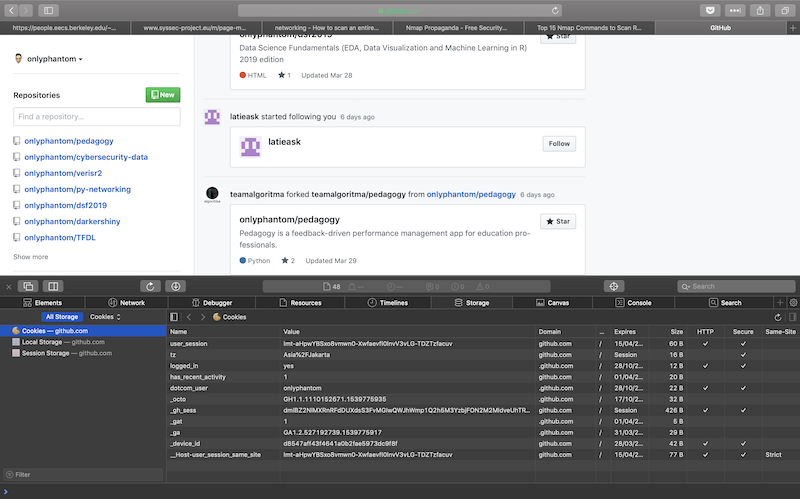

# Cookies
A cookie is a small piece of data that the server sends in a `Set-Cookie` header as part of the response. The client **stores cookies locally** and includes them in any future requests sent to the server. The server can use cookies to:
- track a client as it accesses different areas of a site through tagging them with a unique ID
- store a login token which is used to automatically log the client in when the client re-visit the site again  
- storing the client's preference for personalization



Cookies are necessary because the server has no other way of tracking a client between requests as HTTP is a **stateless** protocol: it doesn't contain an explicit mechanism for a server to determine with certainty that two requests come from the same client.

A case in point is shopping carts, which were the original problem that cookies were developed to solve. Without cookies the server would not know which basket goes with which request.

## Cookie handling
We first create a place for storing the cookies that the server will send us ("`CookieJar`") then use the `build_opener` to extract the cookies from the responses which we then store in our cookie jar:

```py {cmd="/anaconda3/envs/networking/bin/python"}
from http.cookiejar import CookieJar
from urllib.request import build_opener, HTTPCookieProcessor
import datetime
cookie_jar = CookieJar()
print(len(cookie_jar))
opener = build_opener(HTTPCookieProcessor(cookie_jar))
opener.open('http://www.github.com')
print(len(cookie_jar))
print(list(cookie_jar)[2:])
print(list(cookie_jar)[2].name)
print(list(cookie_jar)[2].domain)
print(list(cookie_jar)[2].path)
expiry = list(cookie_jar)[0].expires
expiry2 = list(cookie_jar)[2].expires
print(datetime.datetime.fromtimestamp(expiry))
print(datetime.datetime.fromtimestamp(expiry2))
```

Whenever we use `opener` to make further requests, the `HTTPCookieProcessor` functionality will check our `cookie_jar` to see if it contains any cookies for that site and automatically add them to our requests. It will also add any further cookies that are received to the cookie jar.

The `http.cookiejar` module also contains a `FileCookieJar` class that works the same way as `CookieJar` but provides additional functionality for saving the cookies to a file allowing persistence of cookies across Python sessions.

Inspecting the values of our third cookie, particularly its domain and path attributes, we see that our `urllib` opener will include this cookie in any request it sends to `www.github.com` and its sub-domains, where the path is anywhere below the root. 

Observe also that the first cookie (`logged_in`) expire on 1st April, 2039 while the second cookie (`has_recent_activity`) has only a lifespan of 1 hour. The `expires` attribute tells the client the amount of time it should hold on to the cookie - once it has expired the client will discard the cookie and the server will send a new one with the next request. 

## `HttpOnly` and `secure` flag
Cookies stored on a client can be accessed:
- By the client as part of a HTTP request and response sequence
- By scripts or processes running in the client, such as JavaScript or less commonly now, Flash

The `HttpOnly` flag indicates that the client should only allow **access to a cookie when it's part of an HTTP request or response**. Other methods should be denied access. This protect the client against Cross-Site scripting attacks.

The `secure` flag when `True` indicates that the cookie should only be sent over a secure connection, such as HTTPS. When the server sets this flag, our application should send requests containing this cookie to HTTPS URLs only. 

```py
cookie_jar = CookieJar()
opener = build_opener(HTTPCookieProcessor(cookie_jar))
opener.open("http://www.github.com")
cookies = list(cookie_jar)
print(cookies[0].get_nonstandard_attr('HttpOnly')) # returns None
print(cookies[0]._rest) # returns {'HttpOnly': None}
print(cookies[0].secure) # returns True
```

A question at this point is that our URL requested a response over http yet the server sent us a cookie which it's requesting to be sent only over secure connections, how? As it turns out the response was actually sent over HTTPS and is the result of redirects.

# Redirects
```py {cmd="/anaconda3/envs/networking/bin/python"}
from urllib.request import Request, urlopen
req = Request("http://algorit.ma")
response = urlopen(req)
print(response.url)
print(req.redirect_dict)
```

Observe that as we request for the http version of `algorit.ma` we got redirected instead to the https version and that `urllib` followed the redirect. Notice also that in some http request we may have been redirected more than once. The `redirect_attr` dict contains all the URL we were redirected: 

```py {cmd="/anaconda3/envs/networking/bin/python"}
from urllib.request import Request, urlopen

headers = {
    'Accept-Language': 'id', 
    'User-Agent': 'Mozilla/5.0 (Macintosh; Intel Mac OS X 10_14_2) AppleWebKit/605.1.15 (KHTML, like Gecko) Version/12.0.2 Safari/605.1.15'}

req = Request('http://google.com/gmail', headers=headers)
response = urlopen(req)
print(response.url)
print(req.redirect_dict)
print(len(req.redirect_dict))
```

When we send our first request, the server respond with a redirect status code (301, 302, 303 or 307) along with a `Location` header which contains the new URL. The `urllib` package will submit a new request to that URL, and in the above case receive yet another redirect. The final URL would be the value stored in `response.url`, in this case `https://accounts.google.com/ServiceLogin?...`

If we hit too many redirects for a single request (more than 10 for `urllib`) then `urllib` will suspend and raise an `urllib.error.HTTPError` exception.

