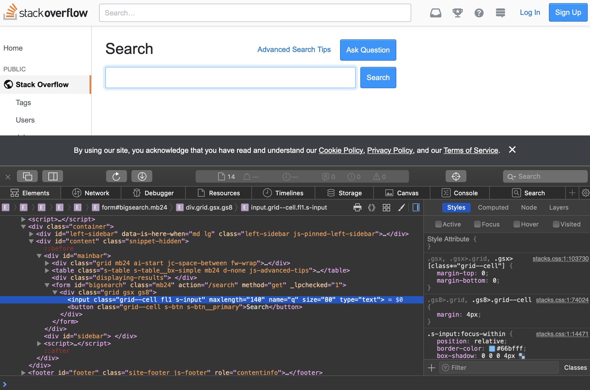

# HTTP methods

## HEAD method
We can use a `GET` method in our request to ask the server to send web resources to us (client). The `HEAD` method is the same as `GET`, with the only difference being that the server will **never include a body in the response**, even if there is a valid resource. `HEAD` is hence useful for checking if a resource exists or if it has changed while saving bandwidth. Note that some servers don't implement this method. 

We use alternative methods (from `GET`) with `urllib` by supplying the method name:
```py
from urllib.request import Request, urlopen
req = Request('http://www.google.com', method='HEAD')
response = urlopen(req)
print(response.status) #200
response.read() # b''
```

The server has returned a `200 OK` response yet the body is empty.

## POST method
In some sense the opposite of `GET`, the `POST` method is used for sending data to the server, such as when submitting user input from forms and when uploading files to a server. The data we wish to send will go in the body of the request and the type is made known by adding a `Content-Type` header to the request with an appropriate `MIME` type.

The server can still send us a full response in return of the `POST` method.

### POST form submission
When sending HTML form data using POST, the data will consist of key / value pairs, formatted in the same way as querystrings and URL-encoded. A `Content-Type` header must also be set to the MIME type of `application/x-www-form-urlencoded`

```py
from urllib.parse import urlencode
from urllib.request import Request, urlopen
data_dict = {'q': 'network programming'}
data = urlencode(data_dict).encode('utf-8')
print(data) # b'q=network+programming'

req = Request('https://stackoverflow.com/search', data=data)
req.add_header('Content-Type', 'application/x-www-form-urlencode;charset=UTF-8')
req.add_header('User-Agent', 'Mozilla/5.0 (iPhone; CPU iPhone OS 11_2_1 like Mac OS X) AppleWebKit/604.4.7 (KHTML, like Gecko) Version/11.0 Mobile/15C153 Safari/604.1')

response = urlopen(req)
data = response.read()
with open("sosearch.html", "wb") as file:
    file.write(data)

```

Notice that in the code above we additionally encode the result to bytes; As it's to be sent as the body of the request, we use the UTF-8 character set. Notice that the presence of the `data` keyword argument tells `urllib` that we want our data to be sent as the body of the request, making our request use the `POST` method instead of `GET`. Finally, we add the `Content-Type` header and submit the request.

Finally, the response data is saved to a file, `sosearch.html` so we can, conveniently enough, view it in a web browser.

A small technicality about how we encoded the form data: `'q':'network programming'`. The `q` key is derived by visiting the actual website and extracting the value of the input's `name` parameter:



# HTTPS
Unless otherwise protected, all HTTP requests and responses are sent in clear text allowing anyone with access to the network (where the message travel on) to intercept and read the content. To prevent this, the standard method for encrypting HTTP traffic is called HTTP Secure, or **HTTPS**. It uses an encryption mechanism called TLS/SSL and is applied to the TCP connection on which the HTTP traffic travels. HTTPS typically uses TCP Port 443 as opposed to the default HTTP port 80.